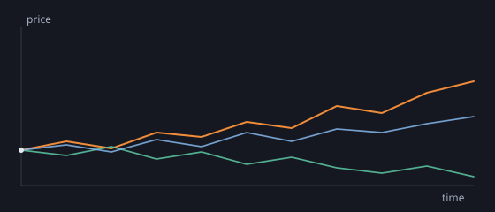

Prices don't move in straight lines. A simple and surprisingly powerful starting point is to treat tomorrow's price as today's price plus a small random nudge.

## Geometric Brownian motion

The standard model writes the change in a price $S$ as:

$$dS = \mu S\,dt + \sigma S\,dW$$

Here $\mu$ is the **drift** (the general direction), $\sigma$ is the **volatility** (how jumpy it is), and $dW$ is the random shock. The nudge is proportional to the price, which is why prices stay positive and why percentage moves — not absolute ones — are what matter.

Simulating a few paths gives the classic fan of possibilities:


*Three independent price paths from the same starting point.*

## The code

The paths above came from a few lines of NumPy:

```python
import numpy as np

def gbm(s0, mu, sigma, days=252, seed=0):
    rng = np.random.default_rng(seed)
    dt = 1 / days
    shocks = rng.normal((mu - 0.5 * sigma**2) * dt,
                        sigma * np.sqrt(dt), days)
    return s0 * np.exp(np.cumsum(shocks))
```

The `exp` and `cumsum` are the important part: shocks add up in *log* space, so the price compounds rather than drifting off into negative numbers.

## Try it yourself

I've attached the full script I used to generate the chart — tweak the drift and volatility and watch the fan widen:

[Download the script (randomness.py)](randomness.py)

## References

- [Hull, *Options, Futures, and Other Derivatives*](https://example.com)
- [Shreve, *Stochastic Calculus for Finance II*](https://example.com)
