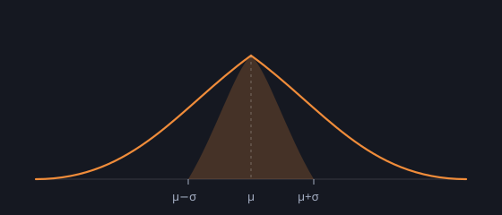

Before we can model markets, we need a way to talk about *how unsure* we are about what comes next. That's exactly what probability gives us.

## Measuring spread

The workhorse measure of uncertainty is the **standard deviation**, written $\sigma$. Loosely, it's the typical distance a value lands from its average $\mu$:

$$\sigma = \sqrt{\mathbb{E}\big[(X - \mu)^2\big]}$$

For many quantities, values cluster around the mean in the familiar bell shape:

*The shaded band shows values within one standard deviation of the mean.*

About 68% of the time a value lands within one $\sigma$ of the mean, and about 95% within two. That single fact underpins a huge amount of risk modelling — including how we reason about the size of a "typical" market move versus an alarming one.

## A word of caution

Real returns have **fatter tails** than the bell curve suggests: extreme moves happen more often than the normal model predicts. Treating $\sigma$ as the whole story is how people get surprised. We'll come back to this when we talk about modelling randomness properly.

## References

- [Wasserman, *All of Statistics*](https://example.com)
- [Taleb, *The Black Swan*](https://example.com)
